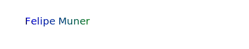

# 👋 Hi there, I'm Felipe Muner!

## 🚀 About Me

I'm a passionate Full-Stack Web Developer with 10 years of experience. I love to work remote with people from everywhere and while we chase our dreams we learn a lot of each other cultures and different viewpoints.

## 📫 How to reach me:

felipe.muner@gmail.com

https://www.linkedin.com/in/felipe-muner/

## 🔧 Technologies & Tools

## 🌱 I’m currently learning ...

blockchain technologies, AI (GPT, agents) to enhance web development and digital interactions.

## I’m looking to collaborate on ...

work with a great team where people together will achieve the dreams faster while having fun.

## 💬 Ask me about ...

How to travel and work remotely to achieve a better life balance.

## 📈 My GitHub Stats

## ⚡ Fun fact:

I've been traveling and working to 30+ countries and lived in 5 of them. I'm a big fan of the outdoors, love to hitchhiking, yoga, sunrise and sunset, and a good cup of coffee.
